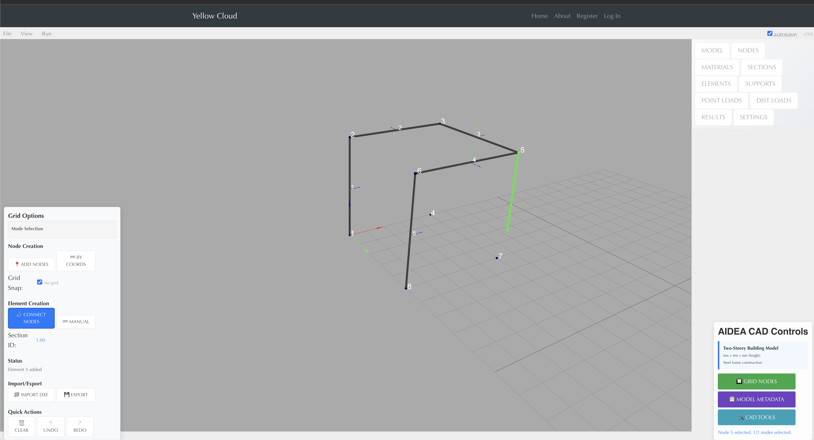

````markdown
# Quick Start

```bash
pip install -r requirements.txt
python app_minimal.py
````

Open **[http://localhost:5000/](http://localhost:5000/)** in your browser.

---

## Design a Two-Storey Building

### 1. Show the Helper Grid

1. Open the **Grid Nodes** modal (bottom-right toolbar).
2. Enable **Grid Nodes**.
   *Auxiliary nodes appear to guide your layout.*
3. Set:

   * **Spacing** – distance between auxiliary nodes
   * **Grid Repetition** – number of grid layers
4. Close the modal.

### 2. Place Structural Nodes

1. Open the **CAD Tools** modal.
2. Click **Add Nodes**.

   * Click on the canvas to add nodes (they snap to the helper grid).
   * Click **Add Nodes** again to exit the mode.

### 3. Connect the Nodes

1. Click **Connect Nodes**.

   * Click consecutive nodes to create members.
   * Press **Esc** to exit, or **C** to toggle continuous-creation mode.





```
```
